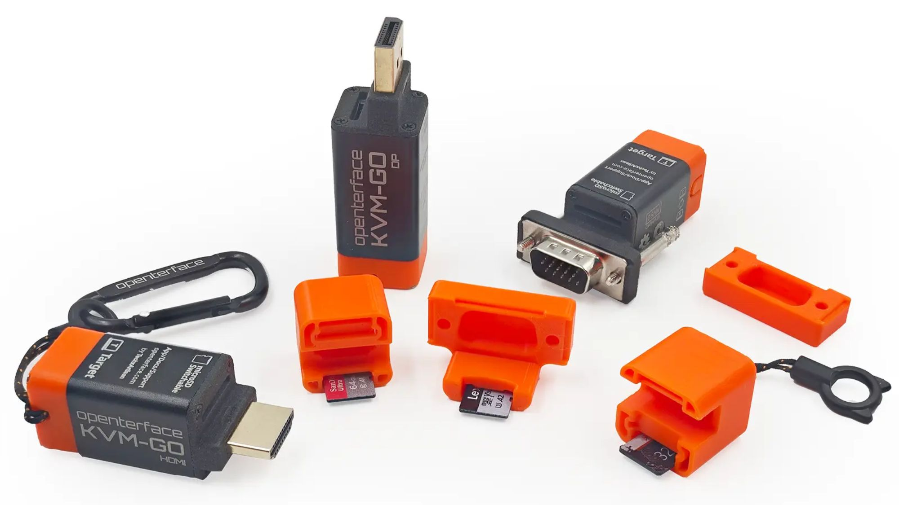

# Welcome to Openterface_KVM-GO_Hardware

## Overview
Designed to fit on your keychain and save your day in a snap, this next-generation KVM-over-USB gadget is built for rapid operations in data centers, remote server rooms, and headless device troubleshooting. Available with HDMI, DisplayPort, or VGA connectors, KVM-GO goes anywhere and plugs into nearly anything.
Built-in Video Connectors Eliminate Cable Chaos
We know the pain of scrambling for the right video cable when you’re deep inside a server room or tinkering with embedded boards, especially when time’s against you. That’s why the KVM-GO series comes with a built-in video connector (HDMI, DP, or VGA), eliminating the need to carry an extra cable. Just plug it directly into the target device and you’re good to go.

