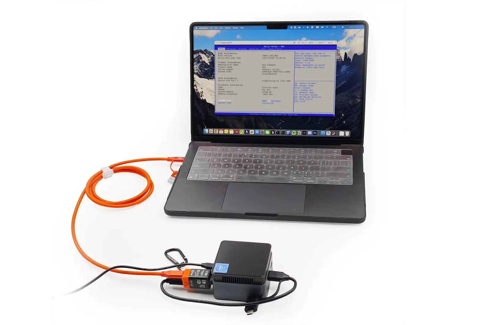

# Welcome to Openterface_KVM-GO_Hardware

## Overview

The [Openterface KVM-GO](https://openterface.com/product/kvm-go/) is a compact and portable open-source KVM-over-USB gadget designed to provide convenient access to headless devices. It allows users to use their laptop, tablet, or smartphone to display and control a target machine through a direct USB connection.

The KVM-GO series includes three hardware variants, designed for different video interfaces:

- KVM-GO HDMI  
- KVM-GO DP  
- KVM-GO VGA  

Each variant integrates a video capture interface and keyboard/mouse emulation into a single compact device. By connecting the device to the target machine’s video output and USB port, users can view the screen and control the system from a host device without requiring network connectivity.

This solution is particularly useful for developers, IT professionals, and hardware enthusiasts who frequently work with servers, embedded systems, or other headless devices.

## Hardware Features

The Openterface KVM-GO PCB board comes with a variety of features designed to provide a seamless and efficient user experience:

- Compact Design: Small and portable form factor suitable for mobile troubleshooting setups.  
- Multiple Video Variants: Available in HDMI, DP, and VGA versions to support different target devices.  
- Direct Plug-in Video Interface: Built-in connector allows direct connection to the target system.  
- USB Connectivity: Simulates keyboard and mouse inputs through a USB connection.  
- Open Source: Fully open-source hardware and software, allowing community-driven development and customization.  
- High Compatibility: Supports a wide range of devices and operating systems.  
- Easy Setup: Plug-and-play functionality with minimal configuration required.  
- [Community Support](https://openterface.com/about/community/): Backed by an active open-source community.

## Software

To use the KVM-GO device, the host device must install an Openterface host application.

Supported platforms include:

- Windows  
- macOS  
- Linux  
- Android  
- iPadOS  
- Web browser applications  

The host application allows users to view the captured video stream and control the target device using keyboard and mouse input.

No software installation is required on the target device. Simply connect a device with a video output and a USB port for keyboard and mouse control.

## license

- Hardware is released under CERN Open Hardware Licence Version 2 - Strongly Reciprocal  
- Its softwares are released under GNU AFFERO GENERAL PUBLIC LICENSE Version 3  
- Documentation is released under [CC BY-SA 4.0](https://creativecommons.org/licenses/by-sa/4.0/legalcode)

## Get Involved

Interested in contributing to the project? We welcome community involvement and contributions. For more information about getting involved, please visit our community pages or contact us directly.

